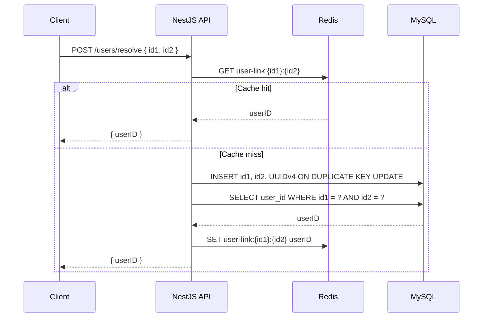

# Mediconcen Backend Code Test

Small NestJS API using TypeScript, MySQL 8, and Redis.

## Quick Brief

NestJS is a structured Node.js framework for TypeScript backends. It borrows ideas from Angular: controllers handle HTTP routes, services hold business logic, and modules group related code. For this project, NestJS gives the backend a clean shape without much ceremony.

Redis is an in-memory data store. Here it is used as a cache: once `(id1, id2)` has been resolved to a `userID`, future requests can return quickly without immediately querying MySQL. MySQL is still the source of truth.

## Run With Docker

```bash
docker compose up --build
```

The API will listen on `http://localhost:3000`.

## Endpoint

```http
POST /users/resolve
Content-Type: application/json

{
  "id1": "abc",
  "id2": "xyz"
}
```

Response:

```json
{
  "userID": "3dfd64cc-4cf0-465c-b736-4f6b19527019"
}
```

If the `(id1, id2)` pair already exists in MySQL, the existing `userID` is returned. If not, the service generates a UUIDv4, inserts the row, caches the result in Redis, and returns it.

## Database Table

The app creates this table on startup:

```sql
CREATE TABLE IF NOT EXISTS user_links (
  id BIGINT UNSIGNED NOT NULL AUTO_INCREMENT PRIMARY KEY,
  id1 VARCHAR(255) NOT NULL,
  id2 VARCHAR(255) NOT NULL,
  user_id CHAR(36) NOT NULL,
  created_at TIMESTAMP NOT NULL DEFAULT CURRENT_TIMESTAMP,
  updated_at TIMESTAMP NOT NULL DEFAULT CURRENT_TIMESTAMP ON UPDATE CURRENT_TIMESTAMP,
  UNIQUE KEY uq_user_links_id1_id2 (id1, id2),
  UNIQUE KEY uq_user_links_user_id (user_id)
);
```

## Sequence Diagram



## Local Development

Install dependencies:

```bash
npm install
```

Start MySQL and Redis:

```bash
docker compose up mysql redis
```

Run the API:

```bash
npm run start:dev
```
