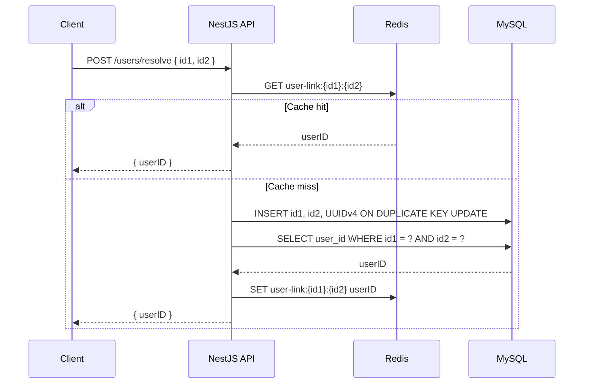

# Mediconcen Backend Code Test

Small NestJS API using TypeScript, MySQL 8, and Redis.

## Quick Brief

NestJS is a structured Node.js framework for TypeScript backends. It borrows ideas from Angular: controllers handle HTTP routes, services hold business logic, and modules group related code. For this project, NestJS gives the backend a clean shape without much ceremony.

Redis is an in-memory data store. Here it is used as a cache: once `(id1, id2)` has been resolved to a `userID`, future requests can return quickly without immediately querying MySQL. MySQL is still the source of truth.

## Run With Docker

Complete the configuration setup below first, including both MySQL passwords. Docker with the Compose plugin is required.

```bash
docker compose up --build
```

With the example `PORT=3000`, the API will listen on `http://localhost:3000`.

## Configuration Setup

From the project root, copy the configuration template:

```powershell
# PowerShell
Copy-Item .env.example .env
```

```bash
# macOS / Linux
cp .env.example .env
```

Fill in `MYSQL_PASSWORD` with your own password. If using Docker Compose, also fill in `MYSQL_ROOT_PASSWORD` with a separate password for MySQL administration. The blank values in the template are intentional; the application does not supply fallback credentials. For passwords containing `#` or `$`, use a single-quoted value in `.env` so the characters remain literal.

| Variable | Purpose |
| --- | --- |
| `PORT` | API listening port. |
| `MYSQL_HOST`, `MYSQL_PORT` | MySQL address for local application execution. |
| `MYSQL_USER`, `MYSQL_PASSWORD`, `MYSQL_DATABASE` | Application database account and database name. |
| `REDIS_HOST`, `REDIS_PORT` | Redis address for local application execution. |
| `REDIS_CACHE_TTL_SECONDS` | Positive integer cache lifetime in seconds. |
| `MYSQL_ROOT_PASSWORD` | Required by Compose to initialize MySQL; not used or passed to the API. |

The application loads `.env` from its working directory. Run the documented commands from the project root. Environment variables already supplied by the shell or deployment platform take precedence over `.env`; a file is optional when all application variables are supplied directly. All application variables listed above are required, ports must be integers from 1 to 65535, and the cache lifetime must be a positive safe integer.

Missing or invalid configuration stops startup with exit code 1 before database or Redis connections are opened. The error lists the affected variable names and directs you to copy and complete `.env.example`; it does not print their values. Compose also rejects missing or empty required values before creating containers.

The template uses `localhost` for running the API on your machine. Compose reads your `.env` values and explicitly uses the internal service names `mysql` and `redis` and their container ports for the containerized API. `MYSQL_PORT` and `REDIS_PORT` in `.env` control their published host ports. You do not need to edit hostnames when switching between the documented local and Docker commands.

Compose initializes the database and application account on the first run with an empty MySQL volume. Changing `.env` passwords later does not update accounts in an existing volume: update those accounts to match before restarting. When using an existing MySQL server instead, create the configured database and application account yourself and grant the account permissions to create the table and read/write its rows. The API creates the `user_links` table on startup.

Local `.env` files are excluded from Git and the Docker build context. Only the configuration template belongs in version control.

## Endpoint

```http
POST /users/resolve
Content-Type: application/json

{
  "id1": "abc",
  "id2": "xyz"
}
```

Response:

```json
{
  "userID": "3dfd64cc-4cf0-465c-b736-4f6b19527019"
}
```

If the `(id1, id2)` pair already exists in MySQL, the existing `userID` is returned. If not, the service generates a UUIDv4, inserts the row, caches the result in Redis, and returns it.

## Database Table

The app creates this table on startup:

```sql
CREATE TABLE IF NOT EXISTS user_links (
  id BIGINT UNSIGNED NOT NULL AUTO_INCREMENT PRIMARY KEY,
  id1 VARCHAR(255) NOT NULL,
  id2 VARCHAR(255) NOT NULL,
  user_id CHAR(36) NOT NULL,
  created_at TIMESTAMP NOT NULL DEFAULT CURRENT_TIMESTAMP,
  updated_at TIMESTAMP NOT NULL DEFAULT CURRENT_TIMESTAMP ON UPDATE CURRENT_TIMESTAMP,
  UNIQUE KEY uq_user_links_id1_id2 (id1, id2),
  UNIQUE KEY uq_user_links_user_id (user_id)
);
```

## Sequence Diagram



## Local Development

Complete Configuration Setup first. Use Node.js 22.13 or later in the Node.js 22 line to match the Docker runtime and the lint dependencies.

Install dependencies:

```bash
npm ci
```

Start MySQL and Redis:

```bash
docker compose up mysql redis
```

Run the API:

```bash
npm run start:dev
```

## Development Checks

Use the Node.js version described above and install dependencies with `npm ci` before running checks.

| Command | Purpose |
| --- | --- |
| `npm run lint` | Check application and test TypeScript with ESLint; fail on errors or warnings without modifying files. |
| `npm run lint:fix` | Apply available ESLint fixes, then report any remaining issues. |
| `npm test` | Compile application and test TypeScript, then run the automated tests. |
| `npm run build` | Build the application for deployment. |
| `npm run check` | Run lint, tests and the application build in order; stop on failure. |

### How the tests work

The suite uses Node's built-in `node:test` runner and `node:assert`, with the existing TypeScript compiler. No additional test-runner dependency is required.

`npm test` first removes the generated `.test-dist` directory so deleted tests cannot run from stale output. It compiles the source and tests with `tsconfig.test.json`, preserving the decorator metadata required by NestJS validation. Node then discovers the compiled `*.test.js` files under `.test-dist/test`, reports each result, and exits with a nonzero status if a test fails. TypeScript compilation errors also fail the command before tests run. Test output is ignored by Git and excluded from the application build.

The initial suite in `test/validation.test.ts` exercises the same validation-pipe factory used by application startup. Its 19 cases check valid inputs, length boundaries, missing values, invalid types, empty or oversized identifiers, and unexpected properties. Rejected inputs must produce a 400 exception with a message identifying the invalid field.

The configuration suite in `test/configuration.test.ts` checks required values, numeric ranges, secret-safe errors, `.env` loading and environment-variable precedence. It also launches the compiled application in an isolated directory with no configuration to verify that startup exits with setup guidance. Test passwords are generated at runtime.

The 76 tests require no `.env`, HTTP server, MySQL or Redis. Persistence, concurrency, HTTP routing and dependency-failure integration checks remain to be added.

To extend the suite, add `*.test.ts` files under `test/`, import `test` from `node:test`, and use assertions from `node:assert`. Keep regression cases alongside each behavior change. The existing NestJS testing package is available for future tests that need dependency injection or provider overrides.

### Inspecting the database during local development

You can access the MySQL monitor on the machine that runs the sql container by:

`docker exec -it mediconcenbackendcodetest-mysql-1 mysql -u <MYSQL_USER> -p`

... and then enter the password provided in your configuration file

For the specific database, enter this from the interactive environment:

`use <MYSQL_DATABASE>`
