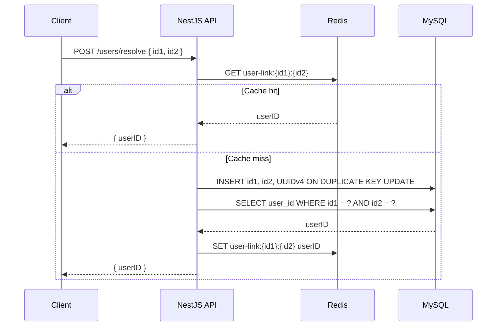

# Mediconcen Backend Code Test

Small NestJS API using TypeScript, MySQL 8, and Redis.

## Quick Brief

NestJS is a structured Node.js framework for TypeScript backends. It borrows ideas from Angular: controllers handle HTTP routes, services hold business logic, and modules group related code. For this project, NestJS gives the backend a clean shape without much ceremony.

Redis is an in-memory data store. Here it is used as a cache: once `(id1, id2)` has been resolved to a `userID`, future requests can return quickly without immediately querying MySQL. MySQL is still the source of truth.

## Run With Docker

```bash
docker compose up --build
```

The API will listen on `http://localhost:3000`.

## Endpoint

```http
POST /users/resolve
Content-Type: application/json

{
  "id1": "abc",
  "id2": "xyz"
}
```

Response:

```json
{
  "userID": "3dfd64cc-4cf0-465c-b736-4f6b19527019"
}
```

If the `(id1, id2)` pair already exists in MySQL, the existing `userID` is returned. If not, the service generates a UUIDv4, inserts the row, caches the result in Redis, and returns it.

## Database Table

The app creates this table on startup:

```sql
CREATE TABLE IF NOT EXISTS user_links (
  id BIGINT UNSIGNED NOT NULL AUTO_INCREMENT PRIMARY KEY,
  id1 VARCHAR(255) NOT NULL,
  id2 VARCHAR(255) NOT NULL,
  user_id CHAR(36) NOT NULL,
  created_at TIMESTAMP NOT NULL DEFAULT CURRENT_TIMESTAMP,
  updated_at TIMESTAMP NOT NULL DEFAULT CURRENT_TIMESTAMP ON UPDATE CURRENT_TIMESTAMP,
  UNIQUE KEY uq_user_links_id1_id2 (id1, id2),
  UNIQUE KEY uq_user_links_user_id (user_id)
);
```

## Sequence Diagram



## Local Development

Install dependencies:

```bash
npm install
```

Start MySQL and Redis:

```bash
docker compose up mysql redis
```

Run the API:

```bash
npm run start:dev
```

## Development Checks

Use Node.js 20 or later (the Docker image uses Node.js 22) and install dependencies with `npm ci` before running checks.

| Command | Purpose |
| --- | --- |
| `npm run lint` | Check application and test TypeScript with ESLint; fail on errors or warnings without modifying files. |
| `npm run lint:fix` | Apply available ESLint fixes, then report any remaining issues. |
| `npm test` | Compile application and test TypeScript, then run the automated tests. |
| `npm run build` | Build the application for deployment. |
| `npm run check` | Run lint, tests and the application build in order; stop on failure. |

### How the tests work

The suite uses Node's built-in `node:test` runner and `node:assert`, with the existing TypeScript compiler. No additional test-runner dependency is required.

`npm test` first removes the generated `.test-dist` directory so deleted tests cannot run from stale output. It compiles the source and tests with `tsconfig.test.json`, preserving the decorator metadata required by NestJS validation. Node then discovers the compiled `*.test.js` files under `.test-dist/test`, reports each result, and exits with a nonzero status if a test fails. TypeScript compilation errors also fail the command before tests run. Test output is ignored by Git and excluded from the application build.

The initial suite in `test/validation.test.ts` exercises the same validation-pipe factory used by application startup. Its 19 cases check valid inputs, length boundaries, missing values, invalid types, empty or oversized identifiers, and unexpected properties. Rejected inputs must produce a 400 exception with a message identifying the invalid field.

These are direct validation tests: they do not start an HTTP server or connect to MySQL or Redis. Persistence, concurrency, HTTP routing and dependency-failure integration checks remain to be added.

To extend the suite, add `*.test.ts` files under `test/`, import `test` from `node:test`, and use assertions from `node:assert`. Keep regression cases alongside each behavior change. The existing NestJS testing package is available for future tests that need dependency injection or provider overrides.
